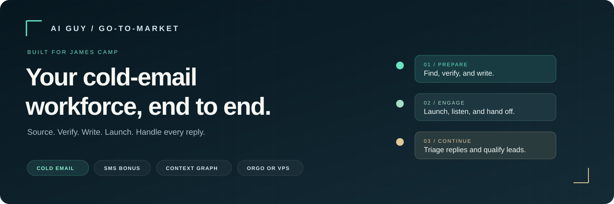
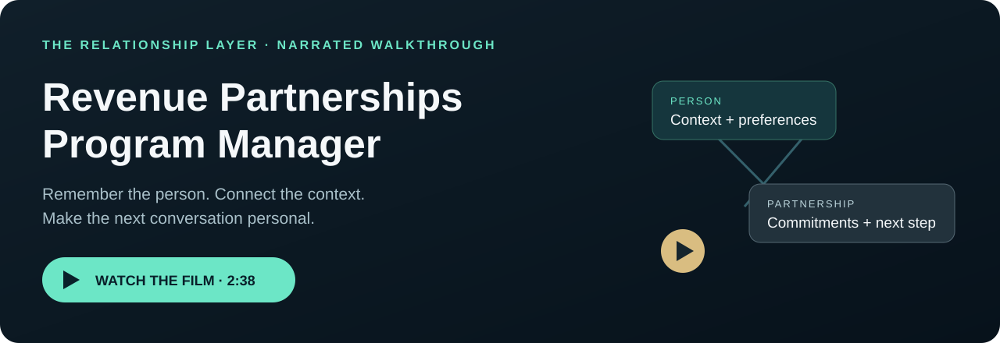
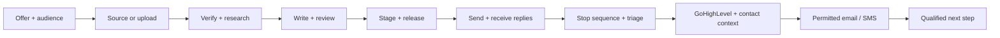

<div align="center">



# AI Guy Go-to-Market

### James Camp’s go-to-market workforce.

**Find the right leads. Send thoughtful outreach. Keep every reply connected to the relationship.**

[**See the proof ↗**](https://truerevenuepartnerships.com/proof/) · [**Start your installation →**](START-HERE.md) · [What you need](docs/READY-TO-RUN.md) · [Explore the toolkit](docs/TOOLKIT.md) · [Meet the team](docs/AGENTS.md)

[](https://github.com/jbellsolutions/james-camp-ai-guy-gtm/actions/workflows/check.yml)
[](docs/DEPLOYMENT.md)
[](docs/AGENTS.md)
[](docs/TOOLKIT.md#gohighlevel-cli-and-mcp)

</div>

---

## Watch the relationship layer

**Revenue Partnerships Program Manager** keeps the people, conversations, introductions and commitments connected. This narrated walkthrough shows the context cards and relationship graph behind the partner workflow.

[](https://jbellsolutions.github.io/james-camp-ai-guy-gtm/)

**[▶ Watch the narrated walkthrough · 2 min 38 sec](https://jbellsolutions.github.io/james-camp-ai-guy-gtm/)** · [Open the video file](assets/video/relationship-layer-narrated.mp4)

The video demonstrates the source relationship system with sample contacts. James’s customer conversations belong to Conversion Specialist; partner relationships belong to the optional Revenue Partnerships Program Manager. His live connections and approved playbooks are verified during setup.

## Your outbound, connected from beginning to end

This is the operating system around the agent: campaign strategy, lead data, verification, personalized copy, independent review, sequencing, reply handling, CRM updates, and follow-through.

Start with a list you already own, or choose a sourcing tool. Prepare a campaign in Instantly or Smartlead. When someone replies, stop the sequence, preserve the conversation, and hand the lead to GoHighLevel. The relationship layer gives the next agent the person’s context, preferences, and open commitments before it writes another message.

Run it on your own [Orgo computer](https://orgo.ai?r=aiguy) or a DigitalOcean VPS. Use Slack to work with the system, review decisions, and keep track of what happens next.

| Prepare the campaign | Handle the reply | Continue the relationship |
|---|---|---|
| Define the offer and audience | Stop the active sequence | Create a contextual contact card |
| Source or import leads | Classify intent and honor opt-outs | Maintain the linked context graph |
| Verify, deduplicate, and research | Draft a relevant response | Continue permitted email/SMS conversations |
| Write and independently review | Pass an acknowledged CRM handoff | Qualify, book, and follow through |

## Start with one message

Paste this into **Claude Code**:

```text
Install https://github.com/jbellsolutions/james-camp-ai-guy-gtm for James Camp.
Read AGENTS.md and START-HERE.md. Walk me through the business choices,
then handle the technical setup on my chosen Orgo computer or VPS.
Install Cold Email, Conversations & Conversion, or both. Reuse my accounts,
keep credentials private, and verify every selected connection before launch.
```

The setup agent asks about your host, offer, data, sequencer, CRM, and Slack. A Chief Sales Officer oversees the workforce. It also offers optional sourcing connections, Composio, and Revenue Partnerships Program Manager. You make the business choices and complete private sign-ins; the agent handles the installation and checks. [Full handoff prompt →](HANDOFF.md)

## Two installations. One workflow.

| Installation | Your team | Responsibility |
|---|---|---|
| **Cold Email + CSO** | 9 Hermes profiles | Chief Sales Officer, Campaign Director, Data & Research, List & Verification, Custom Email Writer, Independent Editorial, ESP & Deliverability, Sequencer Operator, Email Reply Agent |
| **Conversations & Conversion** | 3 Hermes profiles | Agent 4 GoHighLevel Bridge, Conversion Specialist, Conversion & Follow-through |
| **Optional Revenue Partnerships Program Manager** | +1 profile in Conversations | Partner recruiting, onboarding, activation, relationship management, and attribution review |

Install either system independently or both together. Conversion Specialist adapts the relationship engine for customer qualification, personalized replies and consented SMS. Revenue Partnerships Program Manager uses the same engine for partners when enabled. The CSO oversees priorities, assignments and evidence across both installations. [Read the charters →](docs/AGENTS.md)



[Full workflow and acceptance gates →](docs/WORKFLOW.md)

## What you need to run it

**Start with the essentials. Add services as your workflow needs them.**

- [ ] An Orgo computer or Linux VPS, with access for the setup agent.
- [ ] Your offer, ideal customer, truthful proof, sender identity, and booking route.
- [ ] A model-provider account/key. The included runtime starts with Fireworks; other providers need a reviewed configuration.
- [ ] A lead list **or** a selected sourcing route and budget.
- [ ] For cold email: Instantly or Smartlead access, sending domains/mailboxes, DNS access, and an email-verification service.
- [ ] For CRM/SMS: your GoHighLevel location and scoped credentials; a ready sending number and evidenced SMS consent for the people you will text.
- [ ] If using Slack: workspace authorization, bot/app tokens, and your allowed Member ID(s).
- [ ] A designated test email/phone, launch limits, an approver, and an escalation contact.

Git, GitHub CLI, Python, Docker/Compose, and the tool dependencies are handled during guided setup on the selected host. The checklist tracks what is needed **before setup, before the first send, and before ongoing operation**. [Open the complete launch checklist →](docs/READY-TO-RUN.md)

## The toolkit is included

| Component | What ships |
|---|---|
| **GoHighLevel CLI + MCP** | Bundled source, a dedicated venv/connection installer, an operating skill, and Agent 4’s CRM charter. [Inspect the CLI →](vendor/gohighlevel-agency-cli/cli_anything/gohighlevel/gohighlevel_cli.py) |
| **Cold email skills** | Public campaign, copy, deliverability, and reply playbooks; rendered-copy QC; Instantly skills/scripts; Smartlead operations guidance. |
| **CSO oversight** | Sales recovery ledger, dated assignments, daily/weekly review routines, pipeline evidence and client-specific operating identity. |
| **Relationship memory** | The relcore engine, contextual contact cards, linked graph, drafts, and synthetic examples. |
| **Reply workflow** | Authenticated normalized intake, durable event/task ledger, duplicate handling, priority stop/suppression tasks, and receipt acknowledgments. |
| **Hermes deployment** | Pinned runtime, two-install preparation/deployment, profile identities/charters, launchers, health checks, and emergency stop. |
| **Slack** | Two app manifests and a validation/creation helper; workspace installation includes owner consent. |
| **Claude Code + skill authoring** | Plugin/marketplace manifests, installation handoff, and the skill-creator package. |
| **Optional connections** | Data Box and BrowserBox skills/pinned source fetcher; Composio guidance; PlusVibe discovery; Revenue Partnerships Program Manager. |

**Bundled** means code or instructions are in this repository. **Connected** means your account has passed its live test. The [toolkit inventory](docs/TOOLKIT.md) shows the exact files, external dependencies, and remaining connection steps.

## Explore the connected repositories

This handoff packages the core workforce. These companion projects offer additional capabilities; their own setup, access and acceptance requirements apply.

### AI Guy Go-to-Market · your revenue partner

The [Go-to-Market for Orgo repository](https://github.com/jbellsolutions/go-to-market-orgo) is the broader revenue partner: offer and audience research, campaigns, partnerships, proposals and growth coordination. This James Camp edition packages its cold-email-to-conversion workflow with specialist ownership and CSO oversight.

**[Explore the revenue partner repo →](https://github.com/jbellsolutions/go-to-market-orgo)** · [Install this client edition](START-HERE.md)

*Companion repository access required. Selected core source is already bundled here.*

### Revenue Partnerships Program Manager · relationships that compound

Build a partner program around contextual relationships: discover and qualify partners, prepare onboarding, track introductions and open commitments, personalize communication, and review activation and attribution. The name reflects the full relationship role; affiliate programs are one use case.

The packaged optional profile uses the [Affiliate Manager source repository](https://github.com/jbellsolutions/affiliate-manager-agent). [True Revenue Partner](https://github.com/jbellsolutions/true-revenue-partner) is the expanded relationship program builder, with living cards and partner-program playbooks.

**[Explore the relationship engine →](https://github.com/jbellsolutions/affiliate-manager-agent)** · [Explore True Revenue Partner →](https://github.com/jbellsolutions/true-revenue-partner) · [Read the client charter](profiles/affiliate-manager/CHARTER.md)

*Affiliate Manager source is public; True Revenue Partner requires repository access. Enable the packaged role with `--affiliate`; the stable profile ID remains `affiliate-manager`.*

### Lead Radar · find expressed intent

[Lead Radar](https://github.com/jbellsolutions/lead-radar) turns an offer query into ranked people and posts expressing relevant demand, with evidence and drafted openers. Use it as an optional upstream research source, then apply this system’s identity, eligibility, verification and consent gates. It does not automatically contact leads.

**[Explore Lead Radar →](https://github.com/jbellsolutions/lead-radar)** · [Read its portable skill](https://github.com/jbellsolutions/lead-radar/blob/main/skills/lead-radar/SKILL.md)

*Repository access and its own configured services are required. It is linked here, not installed or connected by this package. Review its current evaluation gates before adopting results.*

### Chief Sales Officer · keep the workforce accountable

The [Chief Sales Officer repository](https://github.com/jbellsolutions/chief-sales-officer-orgo) provides the oversight pattern: evidenced stages, named owners, due actions, daily reviews and receipt-backed outcomes. The James-specific CSO profile and selected ledger/routines are already packaged here.

**[Explore the CSO repo →](https://github.com/jbellsolutions/chief-sales-officer-orgo)** · [Activate James’s CSO](docs/CSO.md)

*Companion repository access required. This package uses its own client deployment, not the source’s existing-computer installer.*

## Choose your services

Use accounts you already have. Choose one sequencer and the data providers that fit your audience; you do not need every subscription.

| Purpose | Options |
|---|---|
| Agent computer | [Orgo ↗](https://orgo.ai?r=aiguy) · [DigitalOcean ↗](https://www.digitalocean.com/) |
| Cold email | [Instantly ↗](https://instantly.ai/) · [Smartlead ↗](https://www.smartlead.ai/) · [PlusVibe ↗](https://plusvibe.ai/) (optional discovery) |
| CRM and conversations | [GoHighLevel ↗](https://www.gohighlevel.com/) |
| Leads and verification | [Consulti ↗](https://www.consulti.ai/) · your existing list or verification provider |
| Web data and enrichment | [Firecrawl ↗](https://www.firecrawl.dev/) · [MoltSets ↗](https://moltsets.com/) · [DiscoLike ↗](https://discolike.com/) · [GetLeads ↗](https://www.getleads.io/) |
| Scraping and browser infrastructure | [Apify ↗](https://apify.com/) · [Bright Data ↗](https://brightdata.com/) · [Decodo ↗](https://decodo.com/) · [Hyperbrowser ↗](https://www.hyperbrowser.ai/) |

The directory includes sourcing options to evaluate during setup; it does not imply a working adapter or active subscription for every provider. [Service directory, connection status, and partner links →](docs/SERVICES.md)

> **Partner disclosure:** the Orgo link is an AI Guy referral link. We may earn a commission from qualifying referrals. Other listed links currently open official provider sites. Service choice follows your requirements and budget; current offers and terms belong to the provider.

## What happens before launch

The setup agent installs the chosen systems, runs the synthetic workflow, connects the selected accounts, and verifies the actual email/CRM/SMS path. Campaigns remain paused until the approved audience, exact copy, infrastructure checks, and launch scope are in place. Covered reply playbooks can then be activated under your authorization.

A successful handoff includes installed versions, private access instructions, connection receipts, a restore point, and a clear list of anything left unconnected. Email interest does not create SMS consent. [Live acceptance checklist →](docs/ACCEPTANCE.md)

## Your operating library

| Start and run | Understand and maintain |
|---|---|
| [Guided installation](START-HERE.md) | [Project charter](charters/PROJECT.md) |
| [Launch requirements](docs/READY-TO-RUN.md) | [Agent charters](docs/AGENTS.md) |
| [Toolkit and GHL connection](docs/TOOLKIT.md) | [Contact cards and context graph](docs/CONTEXT-GRAPH.md) |
| [Services and partner directory](docs/SERVICES.md) | [Reply events and handoffs](docs/EVENTS.md) |
| [Orgo / VPS deployment](docs/DEPLOYMENT.md) | [Daily and weekly operations](docs/OPERATIONS.md) · [CSO](docs/CSO.md) |
| [Slack setup](docs/SLACK.md) | [Verification evidence](docs/VERIFICATION.md) |
| [Completion card](templates/COMPLETION.md) | [Security](SECURITY.md) · [Source inventory](docs/SOURCES.md) · [Future workforce scope](docs/WORKFORCE-FOLLOW-ON.md) |

<details>
<summary><strong>For technical teams: verify and prepare locally</strong></summary>

```bash
python3 scripts/check.py
python3 -m unittest discover -s tests -v
python3 scripts/install.py --mode both --prepare-only --state-root /tmp/james-gtm-preview
```

Preparation creates the selected assets without starting services or sending messages. Use [START-HERE](START-HERE.md) for deployment and live connection checks.

</details>

---

<div align="center">

**Built for James Camp. Prepared by AI Guy.**

[Begin the guided setup →](START-HERE.md)

</div>
