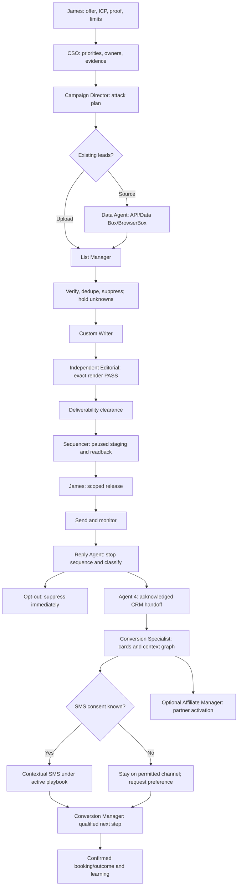

# Campaign to conversation

| Gate | Owner | Artifact and acceptance |
|---|---|---|
| Intake | Director | Offer/ICP, honest proof, owner, caps, source budget and prohibited claims |
| Acquire | Data | Provenance, legal/source constraints, sample, job receipts and counts |
| Eligibility | List | Canonical identity, verification result/time, suppression check, balanced counts |
| Research/copy | Writer | True relevance, cited claims, rendered sequence and copy version |
| Quality | Editorial | Exact artifact hash PASS plus cold-email verifier where applicable |
| Infrastructure | Deliverability | Current DNS/mailbox health, monitored reply channel and adopted pause rules |
| Staging | Sequencer | Paused campaign, provider IDs and exact audience/copy/settings readback |
| Release | James/Director | Approved versions, identity, window, caps, spend, playbook and expiry |
| Monitor | Director/ESP | Provider metrics and holds; no open-rate optimization as final outcome |
| Reply | Reply Agent | Inbound dedupe, immediate stop receipt; opt-out overrides classification |
| CRM | Agent 4 | Contact/opportunity mapping, full-thread reference, next owner and ack |
| Context | Conversion Specialist | Card, brief digest, facts vs assumptions, consent/channel/preferences and open loops |
| Conversation | Relationship/Conversion | Answer actual question, avoid reasking, honor no/not-now, escalate novel commitments |
| Outcome | Conversion/Director | Authoritative appointment/conversion receipt and denominator-aware scorecard |

Reply classes: interested, question, objection, referral/wrong person, out-of-office, soft-no/not-now, unsubscribe/STOP, complaint, unknown. Preserve full thread and sender identity. OOO holds until an evidenced return date. Stop/complaint requires no marketing reply; provider-required system opt-out acknowledgments belong to the provider. No or not-now is not an invitation to pressure. Email reply sends stay on the email platform; consented SMS uses GHL. Capture each obligation with due date and owner.

The framework library and the actual sequence are distinct. Choose a campaign cadence deliberately; stop-on-reply and suppression must apply at every step. If a campaign fails, diagnose infrastructure → audience/list → offer → copy. Change one hypothesis at a time and compare human/positive replies and qualified outcomes.
