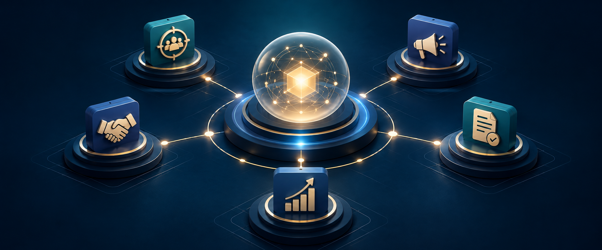

<div align="center">



# Go-To-Market for [Orgo](https://orgo.ai?r=aiguy)

### Turn a clear offer into qualified conversations, partnerships, proposals, and revenue.

A practical **AI Guy** go-to-market partner that remembers the business,
coordinates specialist agents, and keeps growth work moving from one private
[Orgo](https://orgo.ai?r=aiguy) computer.

[**Start the walkthrough →**](START-HERE.md) ·
[Give this link to another AI](AGENTS.md) ·
[Explore the tools](docs/TOOLS.md) ·
[Meet the agent team](docs/AGENT-FACTORY.md) ·
[Understand A2A](docs/A2A.md)

</div>

> **[Orgo](https://orgo.ai?r=aiguy) partner offer:** Get 25% off your first three months on a monthly plan or your first year on a yearly plan. Add-ons are not discounted.

<div align="center">

[](https://github.com/jbellsolutions/go-to-market-orgo/actions/workflows/ci.yml)
[](docs/ORGO.md)
[](https://github.com/NousResearch/hermes-agent/releases/tag/v2026.9.11)
[](docs/A2A.md)
[](docs/PERMISSIONS.md)

</div>

---

## Go to market without adding more busywork

Tell the agent what you sell, who it helps, and the outcome you want. It turns
that direction into research, campaigns, partner activity, proposals, and
follow-up—then returns with evidence and decisions instead of scattered agent
messages.

<table>
<tr>
<td width="33%" valign="top">

### Find the right opportunities

Research markets and accounts, qualify prospects, surface partner and affiliate
channels, and keep the team focused on people most likely to buy.

</td>
<td width="33%" valign="top">

### Create demand

Turn positioning into outreach, campaigns, content, offers, and partner motions
without losing the message or the customer context.

</td>
<td width="33%" valign="top">

### Move revenue forward

Prepare proposals, organize follow-up, update the pipeline, watch the numbers,
and make the next best action obvious.

</td>
</tr>
</table>

---

## One link starts the installation

Give a capable setup agent this repository link:

```text
https://github.com/jbellsolutions/go-to-market-orgo
```

Then paste this prompt:

```text
Install Go-To-Market for Orgo from this repository on my Orgo computer. Read
AGENTS.md, START-HERE.md, llms.txt, and PROMPTS.md first. Handle all technical
work yourself. Preserve any existing agent, credentials, memory, conversations,
and customizations. Walk me through only private sign-ins and approvals, one at
a time. Connect the tools I authorize, keep the dashboard and A2A private, and
finish only when verification passes and a real connected-channel message gets
a real reply.
```

That is the handoff. The repository tells the setup agent how to inspect the
computer, install or upgrade safely, connect Slack or Telegram, add Honcho and
Latitude, configure approved business tools, connect trusted A2A peers, test the
result, and roll back if verification fails.

[Open the first-time walkthrough →](START-HERE.md) ·
[See every copy-ready prompt →](PROMPTS.md)

---

## What you can ask it to do

- “Research the best-fit customers for this offer and show me why they fit.”
- “Build a simple campaign, draft the messages, and wait for approval before sending.”
- “Find potential affiliates and partners, rank them, and prepare the outreach.”
- “Turn these notes into a proposal and flag anything that needs my decision.”
- “Review the pipeline, find what is stuck, and give me the next five actions.”
- “Delegate the research and campaign work, then bring me one combined recommendation.”

It can read, research, organize, analyze, and draft inside its approved
workspace. Sending messages, publishing, changing live records, issuing a
proposal, spending money, or widening permissions stops for owner approval.

## A focused go-to-market team

```text
Business Owner
└── Go-To-Market Partner
    ├── Prospect Research
    ├── Outbound Campaign
    ├── Content Distribution
    └── Affiliate Partnerships
```

The parent agent can propose these persistent specialists from reviewed
templates. Creating one requires a matching approval from the private computer;
an A2A message can never approve a worker or expand its authority.

## Built to remember, measure, and collaborate

| Layer | What it does for the customer |
|---|---|
| Hermes 0.21.2 | Runs the agent, Slack, Telegram, dashboard, browser, skills, and durable work |
| Honcho | Keeps long-term business memory and a distinct identity for every specialist |
| Latitude | Shows how the agent is performing; metadata-only is the safe default |
| Business tools | Connects approved Calendar, email, CRM, proposal, and project accounts |
| A2A | Lets trusted Co-Founder, Operator, Revenue Partner, and other agents collaborate |
| Agent Factory | Creates only approved go-to-market specialists from allowlisted templates |
| Safe updates | Preserves credentials, conversations, memory, and customer customizations |

Agent Bundle is intentionally disabled here. It remains a Co-Founder-owned,
test-first capability unless the owner approves a separate exception.

## Simple on the surface. Serious underneath.

- The dashboard and A2A start private on localhost.
- Every A2A peer gets its own credential and trusted-peer entry.
- External actions and sensitive changes pause for approval.
- Worker profiles do not inherit business-app credentials.
- A one-minute watchdog recovers the agent after an unexpected container exit.
- Small hosts use a 3 GB agent ceiling and receive swap when the host permits it.
- Updates are staged, verified, and rolled back automatically on failure.
- No secret belongs in GitHub, a prompt, an A2A message, or a setup report.

## Documentation

| Guide | What it answers |
|---|---|
| [Start Here](START-HERE.md) | The complete first-time customer walkthrough |
| [Setup-agent brief](AGENTS.md) | What another AI must do after receiving the link |
| [Copy-ready prompts](PROMPTS.md) | Install, connect, and update prompts |
| [Installation](docs/INSTALLATION.md) | Clean install and safe in-place upgrade behavior |
| [Orgo](docs/ORGO.md) | How the agent runs on one private [Orgo](https://orgo.ai?r=aiguy) computer |
| [Slack and Telegram](docs/CHANNELS.md) | Manifests, tokens, allowlists, and message tests |
| [Business tools](docs/TOOLS.md) | Calendar, email, CRM, proposals, and safe permissions |
| [A2A](docs/A2A.md) | Private agent-to-agent discovery, trust, and testing |
| [Agent Factory](docs/AGENT-FACTORY.md) | How specialist agents are proposed and approved |
| [Updates](docs/UPDATES.md) | Preserve-first fleet updates and rollback |
| [Permissions](docs/PERMISSIONS.md) | What the agent may do and what always needs approval |

Go-To-Market for [Orgo](https://orgo.ai?r=aiguy) is an operating tool, not a legal officer, fiduciary, or
signatory. Provider, hosting, model, Honcho, Latitude, Slack, Telegram, and
optional business-tool usage are billed by their vendors.
